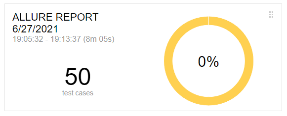
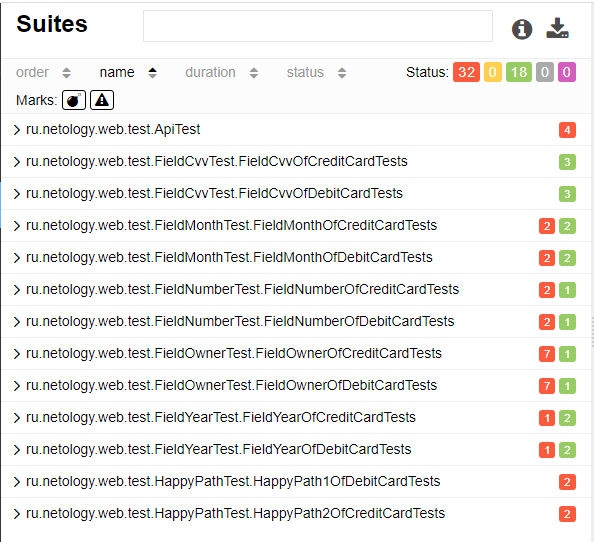

## Отчет по итогам тестирования

### Краткое описание
Проведено автоматизированное тестирование сервиса по покупке туров через интернет-банк.

Общее количество тест-кейсов — 50.
### При подключении к СУБД MySQL

Из них:
Успешных оказалось 21 кейсов - 42%
Не прошли 29 тест кейсов - 58%

### При подключении к СУБД PostgreSQL

Из них: ни один не прошел.
### UI тесты:
* Негативные - 50
### Результаты тестов MySQL

### Результаты тестов PostgreSQL

### API-тесты
Проведено 4 API-теста, все прошли успешно.
