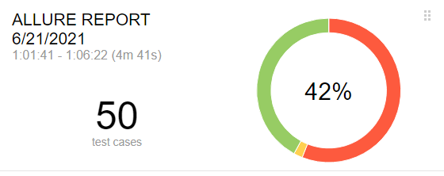
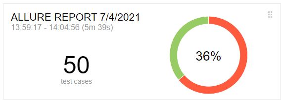
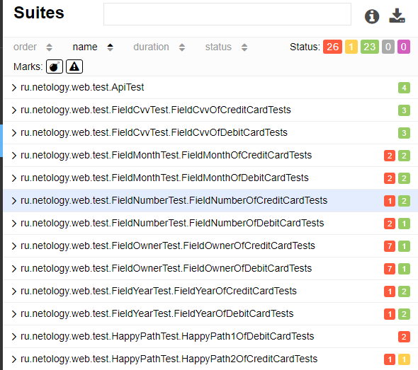
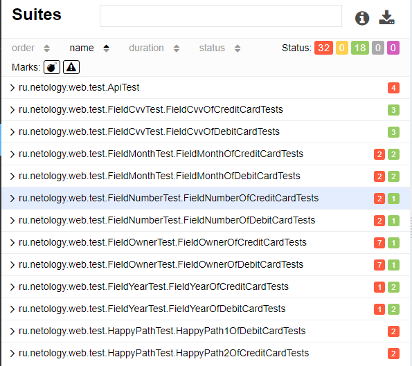
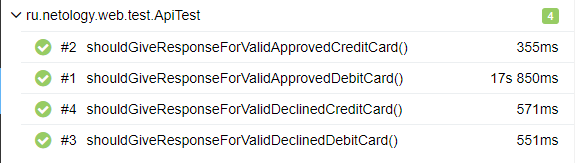
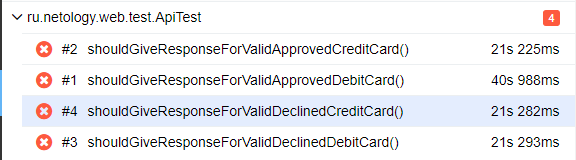

## Отчет по итогам тестирования

### Краткое описание
Проведено автоматизированное тестирование сервиса по покупке туров через интернет-банк.

Общее количество тест-кейсов — 50.
### При подключении к СУБД MySQL

Из них:
Успешных оказалось 21 кейсов - 42%
Не прошли 29 тест кейсов - 58%

### При подключении к СУБД PostgreSQL

Из них:
Успешных оказалось 18 кейсов - 36%
Не прошли 32 кейса - 64%
### UI тесты:
* Негативные - 50
### Результаты тестов MySQL

### Результаты тестов PostgreSQL

### API-тесты

Проведено 4 API-теста:
По MySQL все прошли успешно.

По PostgreSQL, не один не прошел.

### Рекомендации
По результьатам тестирования были заведены следующие - __[Issues](https://github.com/Mikhail9030/QADiplom/issues)__.